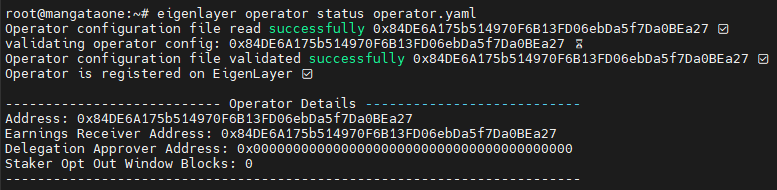

# Installation

### Minimum Gereksinimler <a href="#hardware-requirements" id="hardware-requirements"></a>

| Component     | Specification     |
| ------------- | ----------------- |
| **CPU**       | 16 cores          |
| **Memory**    | 32 GB RAM         |
| **Bandwidth** | 1 Gbps            |
| **Storage**   | 256 GB disk space |

Orjinal dokümanda bu değerler belirtilmiştir. Fakat, 4CPU, 8GB RAM 160 SSD disk içine de rahatlıkla kurabilirsiniz.

Aligend Layer kurabilmek için ilk olarak EigenLayer AVS kurmamı gerekiyor.&#x20;

### EigenLayer CLI Kurulumu

```
sudo apt-get update -y && sudo apt-get upgrade -y
```

#### Docker kuruyoruz..

```
for pkg in docker.io docker-doc docker-compose podman-docker containerd runc; do sudo apt-get remove $pkg; done
```

```
sudo apt-get update
```

```
sudo apt-get install ca-certificates curl gnupg
```

```
sudo install -m 0755 -d /etc/apt/keyrings
```

```
curl -fsSL https://download.docker.com/linux/ubuntu/gpg | sudo gpg --dearmor -o /etc/apt/keyrings/docker.gpg
```

```
sudo chmod a+r /etc/apt/keyrings/docker.gpg
```

```
echo \
  "deb [arch="$(dpkg --print-architecture)" signed-by=/etc/apt/keyrings/docker.gpg] https://download.docker.com/linux/ubuntu \
  "$(. /etc/os-release && echo "$VERSION_CODENAME")" stable" | \
  sudo tee /etc/apt/sources.list.d/docker.list > /dev/null
```

#### Docker Güncelleme ve Çalıştırma

```
sudo apt update -y && sudo apt upgrade -y
```

```
sudo apt-get install docker-ce docker-ce-cli containerd.io docker-buildx-plugin docker-compose-plugin
```

```
sudo docker run hello-world
```

#### Go Kurulumu

```
cd $HOME
ver="1.21.0"
wget "https://golang.org/dl/go$ver.linux-amd64.tar.gz"
sudo rm -rf /usr/local/go
sudo tar -C /usr/local -xzf "go$ver.linux-amd64.tar.gz"
rm "go$ver.linux-amd64.tar.gz"
echo "export PATH=$PATH:/usr/local/go/bin:$HOME/go/bin" >> $HOME/.bash_profile
source $HOME/.bash_profile
go version
```

> Yukarıdaki gereksinimlerin kurulumunu hallettikten sonra EigenLayer adımlarına geçebiliriz.

```
git clone https://github.com/Layr-Labs/eigenlayer-cli.git
cd eigenlayer-cli
```

```
mkdir -p build
```

```
go build -o build/eigenlayer cmd/eigenlayer/main.go
```

```
cd
sudo cp eigenlayer-cli/build/eigenlayer /usr/local/bin/
```

> Şimdi operatör keylerimizi oluşturuyoruz. Bunun için `<key-adı>` silip  (<> dahil siliyoruz.) istediğiniz bir ismi girebilirsiniz.&#x20;

```
eigenlayer operator keys create --key-type ecdsa <key-adı>
```

> Bu adımı girdikten sonra size private key'inizi verecek. Bunu bir yere not etmeyi unutmayın. Daha sonra verdiği private key'i ETH stake etme ve ağı çalıştırma da kullanacağız.&#x20;

Şimdi operatör  bls keylerimizi oluşturuyoruz. Bunun için `<key-adı>` silip  (<> dahil siliyoruz.) istediğiniz bir ismi girebilirsiniz. (Yukarıda verdiğiniz isimi ile aynı ismi verebilirsiniz.)

```
eigenlayer operator keys create --key-type bls <key-adı>
```

> Her iki komuttan sonra da sizden şifre oluşturmanızı isteyecek, bu şifre Karmaşık bir şifre olmalıdır. içinde özel karakterler rakam ve harflerin olduğu bir kombinasyon tercih edebilirsiniz. Verdiğiniz şifreyi unutmayın.

> ecdsa ve bls için hem private key hem de public key'ler alacaksınız, ayrıca ecdsa ve bls için size dosyanın uzantısı verilecek bunların hepsini not etmeyi unutmayın.



#### Daha önce oluşturulmuş EigenLayer Operatörü Çalıştırmak için

* Aşağıdaki komutları girip önceki EVM adresimizi giriyoruz ve aşağıdaki adımları tekrar yapıyoruz.

```
eigenlayer operator keys import --key-type bls <key-adı> <ecdsa private key>
eigenlayer operator keys import--key-type bls <key-adı> <bls private key> 
```


```
eigenlayer operator keys list
```

> Dosya yolları ve public key için yukarıdaki komutu yazıp tekrar çıktı alabilirsiniz.&#x20;

#### Operatör Kaydı

> Yukarıdaki adımları düzgün şekilde yaptıysak aşağıdaki adımları takip ediyoruz.

```
eigenlayer operator config create
```



Aşağıdaki adımları yapmadan önce size Private key verilmiş olan EVM adresine ETH Holesky ağında test ETH göndermeyi unutmayın. EigenLayer AVS çalıştırmak için ortalama 1-1,5 test ETH'ına ihtiyacınız olacak.


* Burada ilk olarak sizden Operatör adresini isteyecek.  ecdsa operator keys için oluşturduğumuz EVM adresini giriyoruz.
* Earning için adres istediğinde aynı EVM adresini verebilirsiniz.&#x20;
* Sizden RPC url isteyecek. Bunu infura yada alchemy'den alabilirsiniz. ETH Holesky ağını seçtiğinizde size özel RPC adresi alabilirsiniz.&#x20;
* Şimdi de sizde ecdsa ve bls key'lerinizin yolunu isteyecek. Bunu da not etmiş olmalısınız oraya o yolu giriyoruz.&#x20;

> Bu adımları yaptıktan  sonra size bir metadata.json ve operator.yaml dosyası oluşturacak, buradaki düzenlemeleri yapıyoruz.

```
nano metadata.json
```

* Burayı açtığınızda size aşağıdaki gibi boş json dosyası çıkartacak. Bunu bir yere kopyalayıp kendi bilgilerinizi düzenleyin.

```
{
  "name": "",
  "website": "",
  "description": "",
  "logo": "",
  "twitter": ""
}
```

* Düzenlemeyi bitirdikten sonra metadata.json dosyasının içindekileri CTRL K ile silip hazırladığınızı içine yazın ve CTRL X Y enter ile kayıt edin.


metadata.json dosyasını dışarıdan da ulaşılabilecek şekilde kayıt etmemiz gerekiyor. Bunun için github kullanabilirsiniz. [BURADAN](https://github.com/CoinHuntersTR/Mangata-AVS?tab=readme-ov-file#metadata-i%CC%87%C5%9Flemleri) nasıl yapılabileceğini bulabilirsiniz. &#x20;


```
nano operator.yaml
```

* Dosyasını açıyoruz ve aldığımız metada url adresini oraya yazıyoruz. Sonrasında kayıt edip çıkıyoruz.

```
eigenlayer operator register operator.yaml
```

* Komutunu çalıştırıyoruz. Tüm adımları doğru şekilde yaptıysanız.&#x20;

<figure><figcaption></figcaption></figure>

Bu şekilde çıktı alıyorsunuz. Sonrasında [BURADAN ](https://holesky.eigenlayer.xyz/operator/)kendi operatörünüzü kontrol edebilirsiniz. AVS aktif edebilmek içinde orada WETH ve LIDO stake gibi alanlara ETH eklemeyi unutmayın.

<figure><figcaption></figcaption></figure>

### Building AligenLayer Operator

Bu adımdan sonra sıra geldi Aligend Layer Operatör kurulum adımlarına.

* İlk olarak bu adımları yapabilmek için Whitelist'e girmeniz gerekiyor. Onun için [BURADAN ](https://docs.google.com/forms/d/e/1FAIpQLSdH9sgfTz4v33lAvwj6BvYJGAeIshQia3FXz36PFfF-WQAWEQ/viewform)formu doldurup başvurunuzu tamamlayabilirsiniz.&#x20;

```
git clone https://github.com/yetanotherco/aligned_layer.git --branch v0.10.2
cd aligned_layer
```

#### Şimdi gereksinimleri kuralım.

```
sudo apt install ca-certificates zlib1g-dev libncurses5-dev libgdbm-dev libnss3-dev curl git wget make jq build-essential pkg-config lsb-release libssl-dev libreadline-dev libffi-dev gcc screen unzip lz4 -y
```

```
sudo apt install -y curl git jq lz4 build-essential cmake perl automake autoconf libtool wget libssl-dev
```

#### Rust kuruyoruz.

```
curl --proto '=https' --tlsv1.2 -sSf https://sh.rustup.rs | sh
```

> size seçenek sorduğunda 1 yazıp enter basın, kurulum bittikten sonra ise aşağıdaki komut ile devam ediyoruz.&#x20;

```
. "$HOME/.cargo/env"
```

#### Foundury kurulumunu yapalım.

```
sudo apt install make
```

```
make install_foundry
export PATH="$HOME/.foundry/bin:$PATH
foundryup
```

```
make build_operator
```

> bu komuttan sonra birkaç dakika bekliyoruz.&#x20;

```
./operator/build/aligned-operator --version
```

Aligned Operator v0.10.2 çıktısı almamız gerekiyor.

```
nano ./config-files/config-operator.yaml
```

> dosyasını açıyoruz. Aşağıdaki sıralyacağım parametreleri değiştirip kayıt ediyoruz.

* `ECDSA Configurations` bölümündeki  `private_key_store_path` bölümüne ecdsa key'inizi dosya yolunu yazıyoruz. `private_key_store_password` kısmına da dosyaya verdiğiniz şifreyiz yazıyoruz.
* `BLS Configurations` bölümüne `private_key_store_path` başlığıa BLS private key dosya yolunu yazıyoruz. `private_key_store_password` kısmına da şifremizi yazıyoruz.&#x20;
* `Operator Configurations` bölümünde `address` ve `earnings_receiver_address` bölümlerine EigenLayer Operatör adresimizi veriyoruz.&#x20;

> Bu işlemleri yaptıktan sonra dosyayı kayıt edip çıkıyoruz.

#### Operatörü Başlatalım.

```
./operator/build/aligned-operator start --config ./config-files/config-operator.yaml
```

