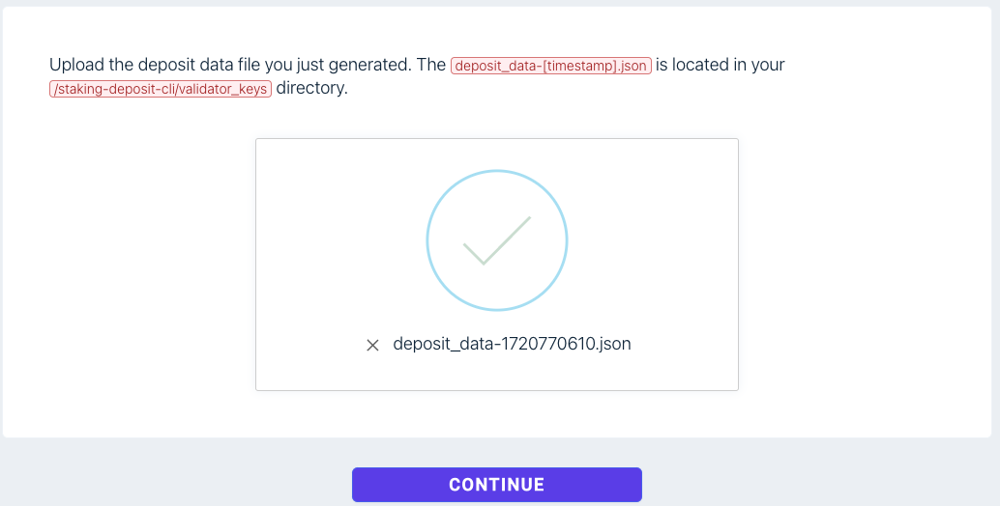

# Andes

#### Başvuru

[BURADAN](https://app.galxe.com/quest/n92t8xtegfVMAFUcXJor9E/GCVWntghfL) Galxe sitesine bağlanıyoruz ve testnet için kullanacağımız cüzdanı ve discordumuzla giriş yapıyoruz. Eğer seçim gerçekleşirse size 2500 DILL token gönderecek ve Andes validator kanalına erişebileceksiniz. Bu adımı tamamladıktan sonra diğer işlemlere geçebilirsiniz. &#x20;

#### Andes Network

Bu parametreleri Metamask cüzdanımıza ekliyoruz.&#x20;

| Network Name    | Dill Testnet Andes                                         |
| --------------- | ---------------------------------------------------------- |
| RPC URL         | [https://rpc-andes.dill.xyz/](https://rpc-andes.dill.xyz/) |
| Chain ID        | 558329                                                     |
| Currency symbol | DILL                                                       |
| Explorer URL    | [https://andes.dill.xyz/](https://andes.dill.xyz/)         |

### Kurulum

| CPU    | RAM  | SSD   |
| ------ | ---- | ----- |
| 2 VCPU | 2 GB | 20 GB |

#### 1. Gerekli Kütüphaneleri yüklüyoruz.&#x20;

```bash
cd $HOME && source <(curl -s https://raw.githubusercontent.com/CoinHuntersTR/Logo/main/update-binary.sh)
```

#### 2. Light Validatörü İndiriyoruz.&#x20;

```bash
curl -O https://dill-release.s3.ap-southeast-1.amazonaws.com/linux/dill.tar.gz
```

#### 3. Paketleri çıkarıyoruz.

```
tar -xzvf dill.tar.gz && cd dill
```

Bu komut dizinde doğrulayıcı anahtarlar üretecektir `./validator_keys`.

> Bu komutu çalıştırdıktan sonra ENTER bastığınızda size gizli kelimelerinizi verecek onu aldığınızda, bir yere not etmeyi unutmayın.&#x20;

```
./dill_validators_gen new-mnemonic --num_validators=1 --chain=andes --folder=./
```

```
ubuntu@ip-xxxx:~/dill$ ./dill_validators_gen new-mnemonic --num_validators=1 --chain=andes --folder=./

***Using the tool on an offline and secure device is highly recommended to keep your mnemonic safe.***

Please choose your language ['1. العربية', '2. ελληνικά', '3. English', '4. Français', '5. Bahasa melayu', '6. Italiano', '7. 日本語', '8. 한국어', '9. Português do Brasil', '10. român', '11. Türkçe', '12. 简体中文']:  [English]: 3
Please choose the language of the mnemonic word list ['1. 简体中文', '2. 繁體中文', '3. čeština', '4. English', '5. Italiano', '6. 한국어', '7. Português', '8. Español']:  [english]: 4
Create a password that secures your validator keystore(s). You will need to re-enter this to decrypt them when you setup your Dill validators.:
Repeat your keystore password for confirmation:
The amount of DILL token to be deposited(2500 by default). [2500]:
This is your mnemonic (seed phrase). Write it down and store it safely. It is the ONLY way to retrieve your deposit.


Creating your keys.
Creating your keystores:	  [####################################]  1/1
Verifying your keystores:	  [####################################]  1/1
Verifying your deposits:	  [####################################]  1/1

Success!
Your keys can be found at: ./validator_keys


Press any key.
```

Eğer Validator'ünüzü taşınmanız gerekirse, aşağıdaki komutu kullanabilirsiniz.&#x20;

> `<mevcut-mnemonic-cümleniz>` yerine gizli kelimeleriniz yazarak girebilirsiniz.&#x20;

```
 ./dill_validators_gen existing-mnemonic --mnemonic="<mevcut-mnemonic-cümleniz>" --num_validators=1 --chain=andes --folder=./
```

#### 5.Validator Keys import ediyoruz.

```
./dill-node accounts import --andes --wallet-dir ./keystore --keys-dir validator_keys/ --accept-terms-of-use
```

_Bu işlem sırasında anahtar deposu parolanızı ayarlayın ve kaydedin._

#### 6.Parolayı bir dosyaya kaydedin

```
echo <your-password> > walletPw.txt
```

#### 7.Light Validatörü Başlatıyoruz.

```
./start_light.sh -p /root/dill/walletPw.txt
```

#### 8.Validatorün Kontrolü

```
tail -f $HOME/dill/light_node/logs/dill.log
```

```
curl -s localhost:3500/eth/v1/beacon/headers | jq
```

```
ps -ef | grep dill
```

```
./health_check.sh -v
```

### Stake&#x20;

İlk önce [BURADAN](https://staking.dill.xyz/) stake sitesine gidiyoruz.&#x20;

`/root/dill/validator_keys/deposit_data-***.json` dosya yolundaki json dosyasını bilgisayarımıza indirelim.&#x20;

<figure><figcaption></figcaption></figure>

Siteye gittiğimizde biraz önce indirdiğimiz json dosyasını içeri aktarıyoruz.&#x20;

<figure><figcaption></figcaption></figure>

Stake için minimum 2500 DILL tokene ihtiyacımız var.&#x20;

<figure><figcaption></figcaption></figure>

Stake miktarını belirledikten sonra, Metamask cüzdanımıza gelen bildirimi onaylıyoruz ve aşağıdaki gibi çıktı aldığımızda işlem tamamlanmış oluyor.&#x20;

<figure><figcaption></figcaption></figure>
