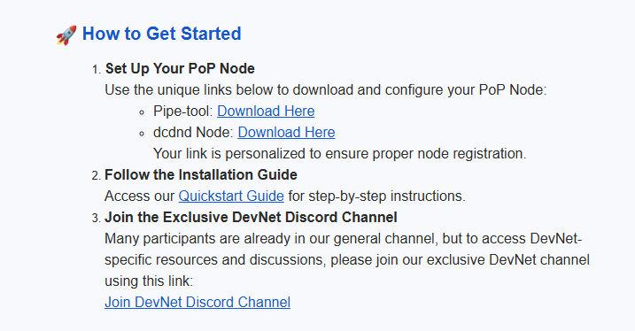

# Installation

Öncelikle Pipe Network'ün devnet testnetine katılmak için, [FORMU ](https://docs.google.com/forms/d/e/1FAIpQLScbxN1qlstpbyU55K5I1UPufzfwshcv7uRJG6aLZQDk52ma0w/viewform)doldurmanız gerekiyor.  Formu doldurduktan sonra, size mail ile bilgileri iletecekler. Bu bilgilerle Node kurabilirsiniz.

Herhangi bir sunucu içine kurabilirsiniz.

#### Sistem gereksinimlerini yükleyelim.

```
sudo apt update -y && sudo apt upgrade -y
```

#### Gerekli olan portları açalım.

```
sudo ufw allow 8002/tcp
sudo ufw allow 8003/tcp
```

#### Değişenlerimizi ayarlayalım.

```
PIPE="Maildeki linki buraya ekle"
DCDND="maildeki linki buraya ekle"
```

<figure><figcaption></figcaption></figure>

Size yukarıdaki gibi mail gelmiş olması gerekiyor. Pipe-tool karşındaki linki sağ tıklayıp adresi "Bağlantı adresini kopyala" diyerek alıyoruz. Yine aynı şekilde dcdnd Node bölümünde aynı işlemi yapıp tırnak içindeki yere ekliyoruz.

```
sudo wget -O $HOME/opt/dcdn/pipe-tool "$PIPE"
sudo wget -O $HOME/opt/dcdn/dcdnd "$DCDND"
```

#### Şimdi izinlerimizi verelim.

```
sudo chmod +x $HOME/opt/dcdn/pipe-tool
sudo chmod +x $HOME/opt/dcdn/dcdnd
```

```
sudo ln -s $HOME/opt/dcdn/pipe-tool /usr/local/bin/pipe-tool -f
sudo ln -s $HOME/opt/dcdn/dcdnd /usr/local/bin/dcdnd -f
```

#### Service dosyasını oluşturalım.

```
# Create service file using cat
sudo cat > /etc/systemd/system/dcdnd.service << 'EOF'
[Unit]
Description=DCDN Node Service
After=network.target
Wants=network-online.target

[Service]
# Path to the executable and its arguments
ExecStart=/opt/dcdn/dcdnd \
                --grpc-server-url=0.0.0.0:8002 \
                --http-server-url=0.0.0.0:8003 \
                --node-registry-url="https://rpc.pipedev.network" \
                --cache-max-capacity-mb=1024 \
                --credentials-dir=/root/.permissionless \
                --allow-origin=*

# Restart policy
Restart=always
RestartSec=5

# Resource and file descriptor limits
LimitNOFILE=65536
LimitNPROC=4096

# Logging
StandardOutput=journal
StandardError=journal
SyslogIdentifier=dcdn-node


# Working directory
WorkingDirectory=/opt/dcdn

[Install]
WantedBy=multi-user.target
EOF
```

#### Login ve Register işlemini yapalım.

```
pipe-tool login --node-registry-url="https://rpc.pipedev.network"
```

Bu komutu girdikten sonra, terminal'de size bir karekod, web sitesi ve 6 hane kod verecek. Bu web sitesini tarayıcı da açıyoruz. Terminal'de verdiği 6 haneli kodu giriyoruz. Sonrasında mail gelen e-posta adresimizle giriş yapıyoruz. Register işlemini tamamlıyoruz.

```
pipe-tool generate-registration-token --node-registry-url="https://rpc.pipedev.network"
```

#### Service başlatıyoruz.

```
sudo systemctl daemon-reload
sudo systemctl enable dcdnd
sudo systemctl restart dcdnd
```

```
sudo journalctl -f -u dcdnd.service
```

> Log kayıtlarını görmek için üstteki komutu girebilirsiniz.

#### Cüzdanımızı oluşturalım.

```
pipe-tool generate-wallet --node-registry-url="https://rpc.pipedev.network" --key-path=$HOME/.permissionless/key.json
```

Bu komuttan sonra sonra sizden bir şifre oluşturmanızı isteyecek, dilerseniz, oluşturmadan geçebilirsiniz.

#### Cüzdan bilgilerimizi yedekleyelim.

Private Key'imizi almak için;

```
pipe-tool show-private-key --key-path=$HOME/.permissionless/key.json
```

Cüzdan adresimizi almak için;

```
pipe-tool show-public-key --key-path=$HOME/.permissionless/key.json
```

En son olarak Node aktif olup olmadığını görmek için aşağıdaki komutu kullanabilirsiniz. Görseldeki gibi bir çıktı alıyorsanız. Sıkınıtı yok!

```
pipe-tool list-nodes --node-registry-url="https://rpc.pipedev.network"
```

<figure><figcaption></figcaption></figure>
